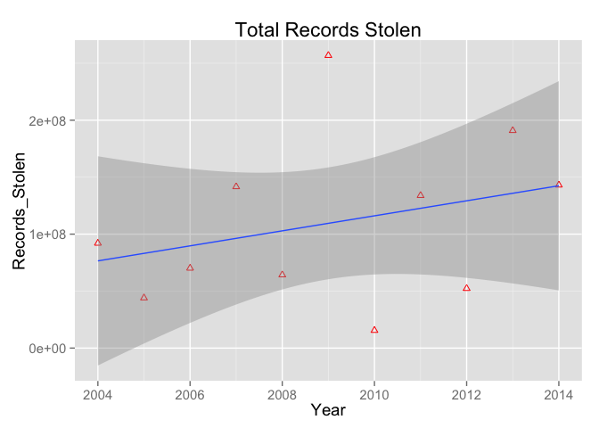
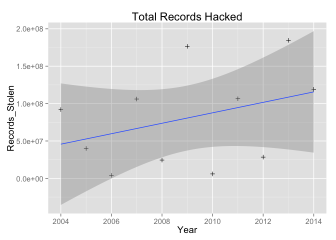

# Breaches Analysis


```
## Loading required package: ggplot2
## Loading required package: xtable
```

###Introduction

This is an analysis of some information security breach data from the website [Information is Beautiful](http://www.informationisbeautiful.net/). There they have made a really elegant bubble chart showing the time evolution of data breaches which can be encoded for a number of factors. 

Thankfully they have made their raw data compilation [available here](https://docs.google.com/spreadsheet/ccc?key=0AmenB57kGPGKdHh6eGpTR2lPQl9NZmo3RlVzQ1N2Ymc&single=true&gid=2&range=A1%3AW400#gid=2) so I've used it for this analysis to expand on some specific questions I wanted to address.  


The specific question I want to address quantitatively is _"How much have the severity and number of hacking-induced data breaches changed over time and is it different than the general trend of breaches."_  

###Cleaned Data  

As mentioned in the intro, the data are made available as a google doc. I've been unable so far to write a successful R program to download the data directly, so in the interest of time I just downloaded their raw data as a .csv  

I made the download copy of the data I use below available on the Github repository linked to this analysis. 


The data was generally in pretty good shape, but I did need to take some steps to clean it up for analysis in R.

Steps to clean the data include:
* Retaining only spreadsheet columns 1-10 to include only data I need.  
* Getting rid of a second descriptive row (which is not data).  
* converting column names to lower case and deleting spaces
* cleaning some formatting of numbers to remove commas etc.   
* Implementing some assumptions about the coding of severities. The legend runs between 1 (least severe) and 5 (most severe). Some of the data are outside this range (e.g. 20 and 50000). Based on my reading of details, I have assumed these are incorrect and have converted them to single digits.  
* Turned the year into actual numerical representation of a calendar year.


```
## Warning: NAs introduced by coercion
```

Here is a random subset of the cleaned data. 
You'll note that one row has blank data for no or recrods stolen. I'm not yet sure why that is but plan to look into it. 


<!-- html table generated in R 3.1.0 by xtable 1.7-3 package -->
<!-- Tue Sep 16 18:23:40 2014 -->
<TABLE border=1>
<TR> <TH>  </TH> <TH> entity </TH> <TH> year </TH> <TH> methodofleak </TH> <TH> noofrecordsstolen </TH> <TH> datasensitivity </TH>  </TR>
  <TR> <TD align="right"> 3 </TD> <TD> Adobe </TD> <TD align="right"> 2014 </TD> <TD> hacked </TD> <TD align="right"> 38000000 </TD> <TD align="right"> 5.00 </TD> </TR>
  <TR> <TD align="right"> 4 </TD> <TD> Advocate Medical Group </TD> <TD align="right"> 2014 </TD> <TD> lost / stolen media </TD> <TD align="right"> 4000000 </TD> <TD align="right"> 2.00 </TD> </TR>
  <TR> <TD align="right"> 13 </TD> <TD> AOL </TD> <TD align="right"> 2014 </TD> <TD> hacked </TD> <TD align="right">  </TD> <TD align="right"> 1.00 </TD> </TR>
  <TR> <TD align="right"> 28 </TD> <TD> UbiSoft </TD> <TD align="right"> 2013 </TD> <TD> hacked </TD> <TD align="right"> 58000000 </TD> <TD align="right"> 2.00 </TD> </TR>
  <TR> <TD align="right"> 52 </TD> <TD> Memorial Healthcare System </TD> <TD align="right"> 2011 </TD> <TD> lost / stolen media </TD> <TD align="right"> 102153 </TD> <TD align="right"> 2.00 </TD> </TR>
  <TR> <TD align="right"> 54 </TD> <TD> Nemours Foundation </TD> <TD align="right"> 2011 </TD> <TD> lost / stolen media  </TD> <TD align="right"> 1055489 </TD> <TD align="right"> 4.00 </TD> </TR>
  <TR> <TD align="right"> 56 </TD> <TD> Oregon Department of Motor Vehicles </TD> <TD align="right"> 2011 </TD> <TD> poor security </TD> <TD align="right"> 1000000 </TD> <TD align="right"> 2.00 </TD> </TR>
  <TR> <TD align="right"> 66 </TD> <TD> Stratfor </TD> <TD align="right"> 2011 </TD> <TD> accidentally published </TD> <TD align="right"> 935000 </TD> <TD align="right"> 3.00 </TD> </TR>
  <TR> <TD align="right"> 124 </TD> <TD> TD Ameritrade </TD> <TD align="right"> 2007 </TD> <TD> hacked </TD> <TD align="right"> 6300000 </TD> <TD align="right"> 1.00 </TD> </TR>
  <TR> <TD align="right"> 125 </TD> <TD> Texas Lottery </TD> <TD align="right"> 2007 </TD> <TD> inside job </TD> <TD align="right"> 89000 </TD> <TD align="right"> 2.00 </TD> </TR>
   </TABLE>

###Aggregate Records Lost  

The trend of total records lost shos a general upward trend. The plot below is a full aggregate of all the data. There is substantial year on year variation, dominantly from the fact that large data breaches are (thankfully) still rare from the standpoint that the 1/sqrt(N) is reasonably large. 

 


###Records Stolen by Hacking  

An interesting segmentation is to look at the records stolen by hacking (s opposed to, say, physical theft or an insider). Hacking is usually associated with malicious outside attack of a vulnerability. The industry is taking increased steps to close vulnerabilities, but the investment in hacks, especially by nation-states and organized crime, is also rising. 


 


As can be seen from the data, breaches from hacks also vary significantly from year to year, but have resulted in a generally upward trend of number of records being lost. The trend line apparently rises faster than the 

###Average severity of Records Stolen by Hacking versus the overall trend


The number of hacks is increasing, as shown above, but is the severity of the attacks, also increasing?  

The data is categorized by severity on a scale of 1-5.   
1. Just email address/Online information   
2. SSN/Personal details   
3. Credit card information   
4. Email password/Health records   
5. Full bank account details  

The analysis to compute the mean severity of attacks is straigtforward. The results, shown below, show that in fact while the severity of hacks are increasing, they are not increasing as fast as the severity of all attacks. 


```
## Loading required package: grid
```

 

```
##    Year 
## 0.08694
```

```
##    Year 
## 0.04554
```

So in response to the orginial question:  

_"How much have the severity and number of hacking-induced data breaches changed over time and is it different than the general trend of breaches."_ 

The number of hacking-induced data breaches has increased 

